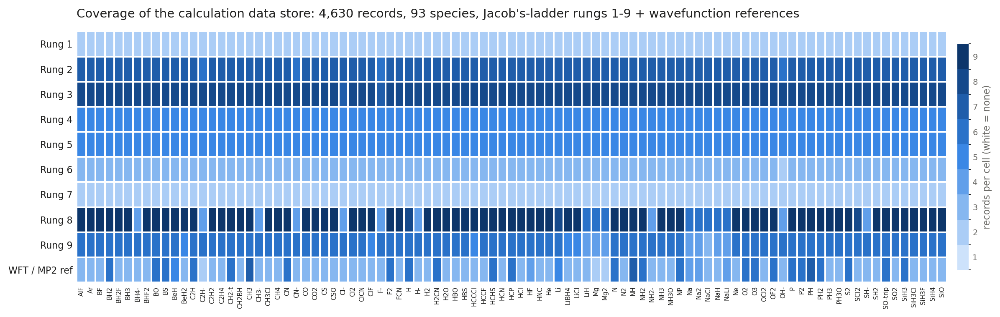

# Benchmark data pipeline: spatial extent of the electron density in DFT

This is the working data repository and analysis pipeline behind the published benchmark study:

> D. Hait\*, Y. H. Liang\*, M. Head-Gordon,
> "Too big, too small, or just right? A benchmark assessment of density functional theory for predicting the spatial extent of the electron density of small chemical systems,"
> *J. Chem. Phys.* **154**, 074109 (2021). [doi:10.1063/5.0038694](https://doi.org/10.1063/5.0038694)
> (\*equal contribution)

The study benchmarks density functionals from every rung of Jacob's ladder against CCSD(T) reference values for properties that probe the electron density (dipole moments, quadrupole moments, and the spatial extent of the density) across small molecules and radicals. This repository holds the pipeline that produced and managed that data: calculation inputs, raw outputs, extraction scripts, a versioned JSON document store, and the analysis notebook behind the paper's tables and figures.

Undergraduate research in the Martin Head-Gordon group, UC Berkeley (2020). Maintained by Jason (Yu Hsuan) Liang.

## Pipeline at a glance

```text
geometries/  +  jacob_ladder.json          inputs: benchmark species + functional registry
        |
        v
Q-Chem calculations (HPC)                  see sample.inp for the annotated input template
        |
        v
output/**/*.out                            raw outputs (DFT, HF, MP2, CCSD(T)/CBS references)
        |
        v
get_*.sh, get_electronic.py                property extraction (dipoles, quadrupoles, spatial extent)
        |
        v
output/output.json                         document store: 4,630 calculation records across 93 species
        |
        v
output/analysis.ipynb                      queries, statistics, tables, and figures for the paper
```

## The data store at a glance



The coverage matrix is complete: all 930 (species, rung) combinations hold at
least one record, with per-cell depth reflecting basis-set coverage. The figure
is regenerated from the store itself by `output/coverage_figure.py`, and the
same matrix is available as a table in `output/coverage_matrix.csv`.

## Repository layout

| Path | What it is |
|------|------------|
| `geometries/` | Benchmark species geometries and Q-Chem input files (`geometries.zip` is an archived copy) |
| `sample.inp` | Annotated Q-Chem input template encoding the SCF robustness settings used throughout (GDM, internal stability analysis, tight convergence thresholds) |
| `jacob_ladder.json` | Registry of 145 density functionals grouped by Jacob's-ladder rung (rung 1, LDA, through rung 9, double hybrids) |
| `output/` | Raw Q-Chem outputs in dated batch folders (`dft/`, `hf/`, `mp2/`), CCSD(T) basis-set-convergence references (`cbs_limit/`), extraction scripts, derived CSV/XLSX tables, and paper figures (`images/`) |
| `output/output.json` | The JSON document store: records keyed by species, each holding method, basis, method type, and extracted properties |
| `output/analysis.ipynb` | The analysis notebook: load/query/save helpers over the document store plus the pandas analysis behind the paper |
| `supporting_information.xlsx` | Supporting information data as published with the paper |

## Data management notes

- `output/output.json` acts as a small document database. The notebook defines query helpers (`search`, `retrieve`, `get_functionals`, ...) over records of the form `{name, method, basis, method_type, ...properties}`.
- Dataset saves were auto-committed via `commit.sh`, so the git history is a versioned snapshot trail of the data store as the project ran; the terse "save" commit messages are those automated data checkpoints.
- Reference values come from CCSD(T) calculations converged through aug-cc-pcVTZ/QZ/5Z basis sets (`output/cbs_limit/`).

## Citation

```bibtex
@article{hait2021toobig,
  author  = {Hait, Diptarka and Liang, Yu Hsuan and Head-Gordon, Martin},
  title   = {Too big, too small, or just right? A benchmark assessment of density
             functional theory for predicting the spatial extent of the electron
             density of small chemical systems},
  journal = {J. Chem. Phys.},
  volume  = {154},
  pages   = {074109},
  year    = {2021},
  doi     = {10.1063/5.0038694}
}
```

## License

Apache License 2.0 (see `LICENSE`).
